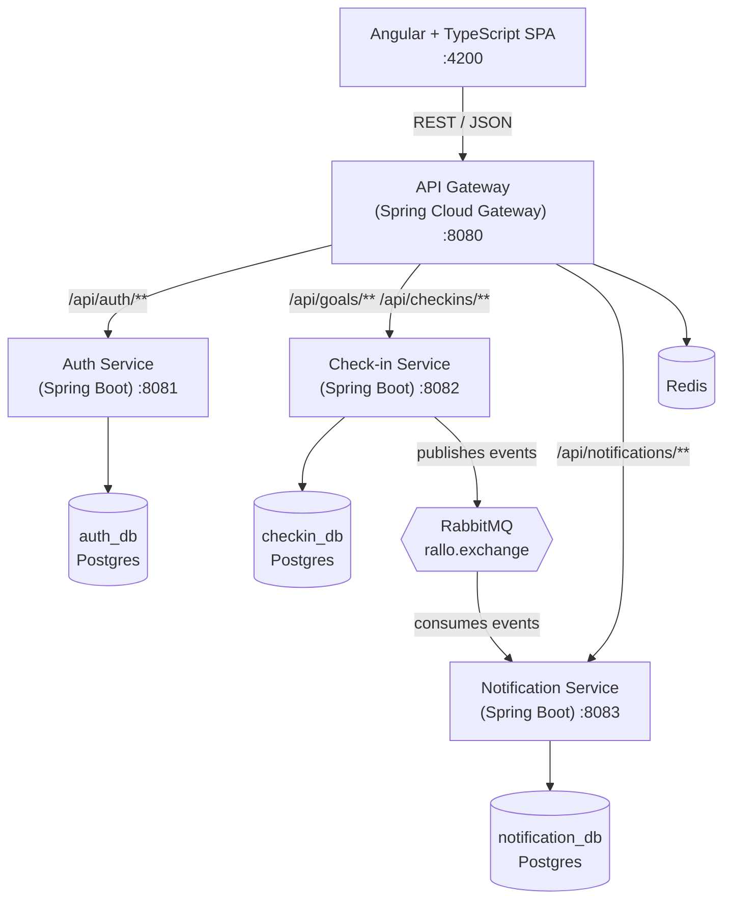

# Rallo — Architecture

A study/gym accountability platform: users set a recurring goal, check in, build streaks, and (eventually) keep friends accountable in groups. Built as a Spring Boot microservices backend with an Angular frontend, verified by a security-scanned CI pipeline.

This document explains the design and its trade-offs; see the [README](README.md) for how to run the project. The roadmap section uses checkboxes so progress can be tracked directly in the repo.

---

## System overview

The Angular client only ever talks to the gateway. The gateway validates the JWT and routes to the right service. Services communicate asynchronously over RabbitMQ where no immediate response is needed; identity flows downstream as trusted headers rather than re-validated tokens.

---

## Services

### API Gateway — Spring Cloud Gateway
Single entry point for the frontend. Validates the JWT signature once at the edge, then forwards caller identity to downstream services as `X-User-Id` / `X-User-Name` / `X-User-Roles` headers — services never trust client-supplied identity ([ADR 0002](docs/adr/0002-jwt-at-the-edge.md)). Handles CORS and routes `/api/auth/**`, `/api/goals/**`, `/api/checkins/**`, and `/api/notifications/**`. *Planned:* Redis-backed rate limiting.

### Auth Service — Spring Boot
Owns identity and the social graph.
- Registration, login, JWT access + refresh tokens (Spring Security)
- Password hashing with BCrypt
- Roles (`USER`, `ADMIN`) with method-level authorization enabled
- Friendships: request by username, accept, list — the accountability graph
- Groups: create, owner-managed membership, member-only visibility
- *Planned:* user profiles

### Check-in Service — Spring Boot
The core domain.
- Goals (e.g. "gym 4×/week", "study Spring Boot daily") with daily or weekly frequency
- Check-ins (one per goal per day, enforced by a unique constraint) and streak calculation — daily streaks and ISO-week weekly streaks with per-week targets, evaluated in the user's timezone (browser-sent `X-Timezone`)
- Friends/group streak leaderboards: composes the auth service's social graph with local streak data ([ADR 0004](docs/adr/0004-leaderboard-composition.md)); Redis cache-aside with graceful fallback when Redis is absent
- Publishes `checkin.recorded` and `streak.broken` events to RabbitMQ
- *Planned:* grace days

### Notification Service — Spring Boot
- Consumes check-in events and persists in-app notifications (7-day streak milestones, broken-streak alerts)
- REST API to list notifications, count unread, and mark as read
- Nightly reminder job: an event-built `goal_activity` read model ([ADR 0003](docs/adr/0003-notification-read-model.md)) finds at-risk streaks (`STREAK_REMINDER`, deduplicated per day) and lapsed ones (`STREAK_BROKEN`)
- *Planned:* push/email delivery, per-user notification preferences

---

## Data layer

**Database-per-service (Postgres).** Each service owns its own schema and no service reaches into another's database — they coordinate through APIs and events. This is the principle that distinguishes a real microservices design from a distributed monolith.

**Redis** caches group leaderboards (60 s TTL, best-effort with graceful fallback — see [ADR 0004](docs/adr/0004-leaderboard-composition.md)); gateway rate limiting is planned.

Schemas are versioned with **Flyway** (`db/migration` per service, `baseline-on-migrate` for databases that predate it); Hibernate runs in `validate` mode so drift between entities and schema fails fast — exercised against real Postgres by the Testcontainers integration tests.

---

## Messaging (event-driven)

RabbitMQ (topic exchange `rallo.exchange`, JSON payloads) decouples the services:

1. User checks in → check-in service writes the record and recalculates the streak.
2. Check-in service publishes `checkin.recorded`.
3. Notification service consumes it and, on a milestone (every 7 days), persists a congratulatory notification.
4. `streak.broken` follows the same path for broken streaks.

Combined with the nightly `@Scheduled` reminder job, this covers both async event-driven and scheduled-task patterns.

---

## Security & DevSecOps

Security lives in the pipeline, not just in a login screen.

**Application security**
- JWT auth with refresh tokens; the gateway validates before routing
- BCrypt password hashing; stateless sessions
- Role-based + method-level authorization
- Downstream services only accept requests stamped with a gateway-injected shared secret (`X-Gateway-Secret`), so they cannot be called directly even when the hosting platform gives them public URLs
- Secrets via environment variables (`.env` locally, platform-generated in the cloud) — never committed

**Pipeline (GitHub Actions, on every push and pull request)**
- Backend build + unit + integration tests (`./mvnw verify`)
- Frontend production build + headless browser tests
- Dependency/vulnerability scan (OWASP Dependency-Check)
- Container image scan (Trivy, results uploaded to GitHub Security)
- Secret scan (gitleaks, full history)
- SAST via CodeQL (Java + TypeScript)
- *Planned:* branch protection requiring all checks before merge

---

## Testing

- **Unit tests:** JUnit 5 + Mockito + AssertJ — streak calculation, auth flows, JWT issue/verify (including forged and expired tokens), the gateway JWT filter, notification handling
- **Integration tests:** Testcontainers boots each service against real Postgres/RabbitMQ/Redis; skipped automatically when Docker is unavailable, always run in CI
- **Frontend:** Jasmine/Karma specs run in headless Chrome
- **E2E:** Playwright drives the full compose stack in CI — register → goal → check-in → streak across every service and both message hops
- *Planned:* contract tests between services (Spring Cloud Contract)

---

## Documentation

- `springdoc-openapi` — live Swagger UI per service (see README for URLs)
- This `ARCHITECTURE.md`, including the diagram above
- [ADRs](docs/adr/) recording the key decisions and their trade-offs
- A [user guide](docs/USER_GUIDE.md) walking through the app's features

---

## Cloud & deployment

- Each service containerized with a multi-stage Docker build; the frontend ships as a static bundle behind nginx, which proxies `/api/**` to the gateway
- `docker-compose` runs the full local stack (4 services + frontend + 3× Postgres + RabbitMQ + Redis)
- Deploy target: Render free tier ([render.yaml](render.yaml) blueprint, auto-deploys every merge to `main`) + Neon Postgres + CloudAMQP; setup guide in [DEPLOY.md](DEPLOY.md) (*account setup is the remaining step*)
- Optional flex: managed Kubernetes (EKS/GKE) with infrastructure defined in Terraform

---

## Build roadmap

Sequenced so the pipeline and a deployable slice exist early.

### Phase 0 — foundation
- [x] Repo + `docker-compose` skeleton
- [x] Auth service: registration + login + JWT
- [x] Unit + integration tests (Testcontainers)
- [x] Swagger via springdoc-openapi
- [x] GitHub Actions CI with security scans
- [x] Deploy to the cloud (Render + Neon + CloudAMQP — live)

### Phase 1 — core MVP
- [x] Check-in service: goals, check-ins, streak logic (daily + weekly, timezone-aware)
- [x] API gateway in front of all services
- [x] Angular shell: register, log in, guarded dashboard listing goals
- [x] Angular MVP: create a goal, check in, see streak, notifications bell
- [x] Deploy the full slice — live demo in the README

### Phase 2 — async + caching
- [x] RabbitMQ + Notification service (event consumers + notification API)
- [x] Reminder job: event-built read model, at-risk reminders, broken-streak detection
- [x] Redis for group leaderboards (cache-aside, graceful fallback)

### Phase 3 — polish + hardening
- [x] Social features: friendships, groups, streak leaderboards (backend + Angular)
- [x] Pipeline hardening: Trivy, dependency + secret scans
- [x] SAST (CodeQL) on Java + TypeScript
- [ ] Branch protection requiring all checks as merge gates
- [x] Flyway migrations (Hibernate in validate mode)
- [x] Playwright E2E of the full stack in CI
- [x] ADRs + user guide

### Phase 4 — optional flex
- [ ] Terraform / Kubernetes
- [ ] Contract tests between services
- [ ] Learning-roadmap feature ("here's a prerequisite path for your goal")

---

## Summary

> A Spring Boot microservices backend — Spring Cloud Gateway in front, Spring Security for auth, Spring Data JPA per service, Spring AMQP for events — with an Angular frontend and a containerized, security-scanned delivery pipeline.
