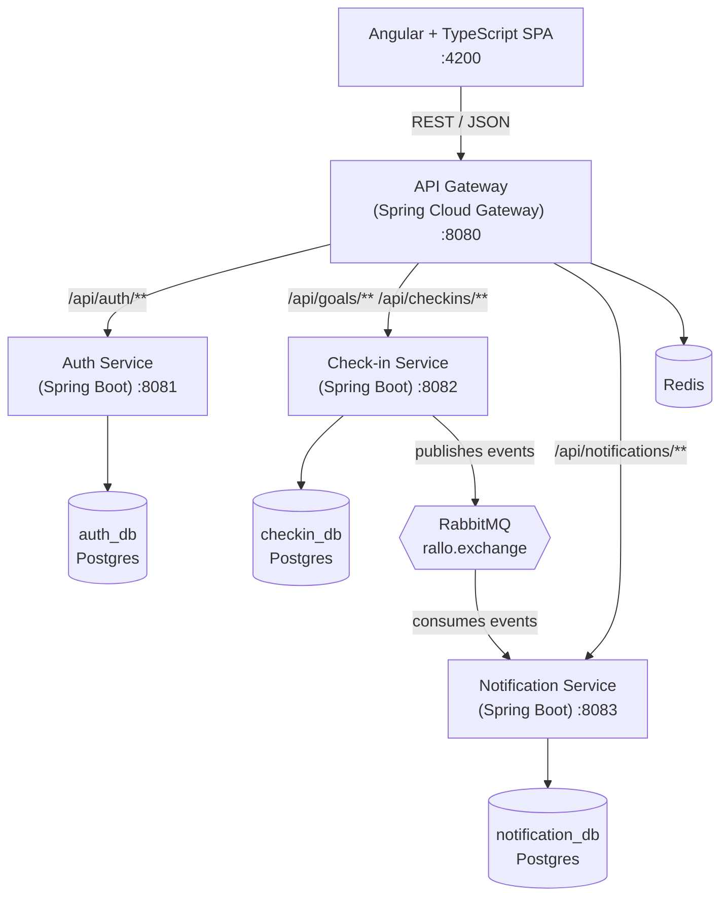

# Rallo — Architecture

A study/gym accountability platform: users set a recurring goal, check in, build streaks, and (eventually) keep friends accountable in groups. Built as a Spring Boot microservices backend with an Angular frontend, verified by a security-scanned CI pipeline.

This document explains the design and its trade-offs; see the [README](README.md) for how to run the project. The roadmap section uses checkboxes so progress can be tracked directly in the repo.

---

## System overview

The Angular client only ever talks to the gateway. The gateway validates the JWT and routes to the right service. Services communicate asynchronously over RabbitMQ where no immediate response is needed; identity flows downstream as trusted headers rather than re-validated tokens.

---

## Services

### API Gateway — Spring Cloud Gateway
Single entry point for the frontend. Validates the JWT signature once at the edge, then forwards caller identity to downstream services as `X-User-Id` / `X-User-Roles` headers — services never trust client-supplied identity. Handles CORS and routes `/api/auth/**`, `/api/goals/**`, `/api/checkins/**`, and `/api/notifications/**`. Redis backs gateway-level concerns such as rate limiting.

### Auth Service — Spring Boot
Owns identity.
- Registration, login, JWT access + refresh tokens (Spring Security)
- Password hashing with BCrypt
- Roles (`USER`, `ADMIN`) with method-level authorization enabled
- *Planned:* user profiles, friendships, and study/gym groups

### Check-in Service — Spring Boot
The core domain.
- Goals (e.g. "gym 4×/week", "study Spring Boot daily") with daily or weekly frequency
- Check-ins (one per goal per day, enforced by a unique constraint) and streak calculation
- Publishes `checkin.recorded` and `streak.broken` events to RabbitMQ
- *Planned:* grace days and timezone-aware period boundaries, weekly-frequency streaks, Redis-cached group leaderboards

### Notification Service — Spring Boot
- Consumes check-in events and persists in-app notifications (7-day streak milestones, broken-streak alerts)
- REST API to list notifications, count unread, and mark as read
- Nightly `@Scheduled` job scaffolded for streak-break reminders (*logic planned*)
- *Planned:* push/email delivery, per-user notification preferences

---

## Data layer

**Database-per-service (Postgres).** Each service owns its own schema and no service reaches into another's database — they coordinate through APIs and events. This is the principle that distinguishes a real microservices design from a distributed monolith.

**Redis** backs gateway rate limiting today; leaderboard/standings caching is planned alongside group features.

Schemas are currently managed by Hibernate (`ddl-auto: update`) for development speed; the move to versioned Flyway migrations is on the roadmap before any production deployment.

---

## Messaging (event-driven)

RabbitMQ (topic exchange `rallo.exchange`, JSON payloads) decouples the services:

1. User checks in → check-in service writes the record and recalculates the streak.
2. Check-in service publishes `checkin.recorded`.
3. Notification service consumes it and, on a milestone (every 7 days), persists a congratulatory notification.
4. `streak.broken` follows the same path for broken streaks.

Combined with the nightly `@Scheduled` reminder job, this covers both async event-driven and scheduled-task patterns.

---

## Security & DevSecOps

Security lives in the pipeline, not just in a login screen.

**Application security**
- JWT auth with refresh tokens; the gateway validates before routing
- BCrypt password hashing; stateless sessions
- Role-based + method-level authorization
- Secrets via environment variables (`.env` locally, repo secrets in CI) — never committed

**Pipeline (GitHub Actions, on every push and pull request)**
- Backend build + unit + integration tests (`./mvnw verify`)
- Frontend production build + headless browser tests
- Dependency/vulnerability scan (OWASP Dependency-Check)
- Container image scan (Trivy, results uploaded to GitHub Security)
- Secret scan (gitleaks, full history)
- *Planned:* SAST (CodeQL or SonarCloud) and branch protection requiring all checks before merge

---

## Testing

- **Unit tests:** JUnit 5 + Mockito + AssertJ — streak calculation, auth flows, JWT issue/verify (including forged and expired tokens), the gateway JWT filter, notification handling
- **Integration tests:** Testcontainers boots each service against real Postgres/RabbitMQ/Redis; skipped automatically when Docker is unavailable, always run in CI
- **Frontend:** Jasmine/Karma specs run in headless Chrome
- *Planned:* E2E tests (Cypress or Playwright), contract tests between services (Spring Cloud Contract)

---

## Documentation

- `springdoc-openapi` — live Swagger UI per service (see README for URLs)
- This `ARCHITECTURE.md`, including the diagram above
- *Planned:* ADRs (architecture decision records) and a short user guide

---

## Cloud & deployment

- Each service containerized with a multi-stage Docker build; the frontend ships as a static bundle behind nginx, which proxies `/api/**` to the gateway
- `docker-compose` runs the full local stack (4 services + frontend + 3× Postgres + RabbitMQ + Redis)
- Deploy target: Fly.io or Render for containers + managed Postgres, triggered from CI on merge to `main` (*pipeline stage exists as a placeholder; wiring credentials is the remaining step*)
- Optional flex: managed Kubernetes (EKS/GKE) with infrastructure defined in Terraform

---

## Build roadmap

Sequenced so the pipeline and a deployable slice exist early.

### Phase 0 — foundation
- [x] Repo + `docker-compose` skeleton
- [x] Auth service: registration + login + JWT
- [x] Unit + integration tests (Testcontainers)
- [x] Swagger via springdoc-openapi
- [x] GitHub Actions CI with security scans
- [ ] Deploy auth service to the cloud (prove the pipeline end-to-end)

### Phase 1 — core MVP
- [x] Check-in service: goals, check-ins, streak logic (daily)
- [x] API gateway in front of all services
- [x] Angular shell: register, log in, guarded dashboard listing goals
- [ ] Angular MVP: create a goal, check in, see streak
- [ ] Deploy the full slice

### Phase 2 — async + caching
- [x] RabbitMQ + Notification service (event consumers + notification API)
- [x] Scheduled reminder job scaffold (`@Scheduled`)
- [ ] Reminder job logic (find at-risk streaks, send reminders)
- [ ] Redis for leaderboards/standings

### Phase 3 — polish + hardening
- [ ] Dashboards and group features (Angular)
- [x] Pipeline hardening: Trivy, dependency + secret scans
- [ ] SAST (CodeQL / SonarCloud) + branch protection as merge gates
- [ ] Cloud deploy of all services
- [ ] Flyway migrations
- [ ] ADRs + user guide

### Phase 4 — optional flex
- [ ] Terraform / Kubernetes
- [ ] Contract tests between services
- [ ] Learning-roadmap feature ("here's a prerequisite path for your goal")

---

## Summary

> A Spring Boot microservices backend — Spring Cloud Gateway in front, Spring Security for auth, Spring Data JPA per service, Spring AMQP for events — with an Angular frontend and a containerized, security-scanned delivery pipeline.
