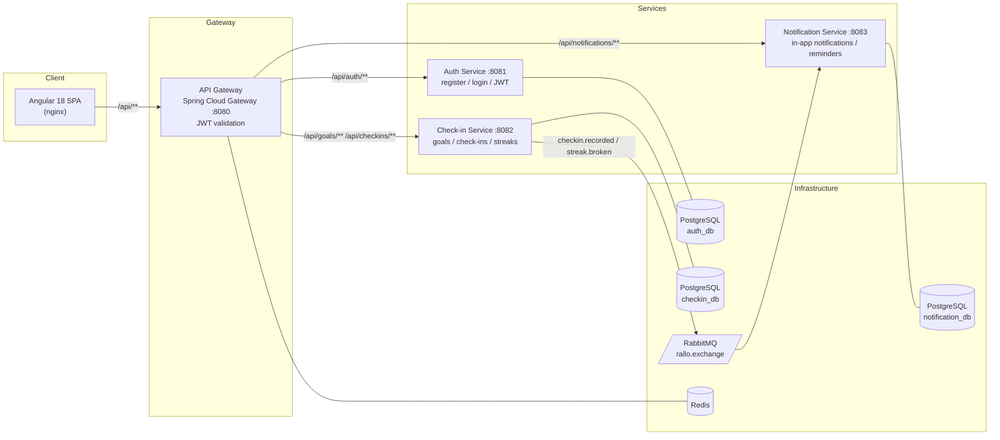

# Rallo

[](https://github.com/Jainoir/Rallo/actions/workflows/ci.yml)

**Rallo** is an accountability app for building habits — track study or gym streaks, set daily/weekly goals, get reminded when a streak is at risk, and stay accountable with friends and group leaderboards.

Built as a production-style **Java / Spring Boot microservices** backend with an **Angular / TypeScript** frontend, wired together with an API gateway, per-service PostgreSQL databases, and event-driven messaging over RabbitMQ.

**🌐 Live demo:** [rallo-jainoir-web.onrender.com](https://rallo-jainoir-web.onrender.com) — register, add a goal, check in. *(Free-tier hosting: the first request after idle takes ~1 minute while services wake.)*


## Architecture

A deeper dive — service responsibilities, trade-offs, and the phased roadmap — lives in [ARCHITECTURE.md](ARCHITECTURE.md).



**Key design decisions**

- **Database per service** — each service owns its schema; no shared tables, no cross-service joins.
- **JWT validated once at the edge** — the gateway verifies the token and forwards caller identity to downstream services via `X-User-Id` / `X-User-Roles` headers, so services never trust client-supplied identity.
- **Event-driven notifications** — the check-in service publishes `checkin.recorded` and `streak.broken` events to RabbitMQ; the notification service consumes them asynchronously and persists in-app notifications (7-day streak milestones, broken-streak alerts).
- **Stateless services** — horizontal scaling requires no session affinity; Redis backs gateway-level concerns such as rate limiting.

## Tech stack

| Layer | Technology |
|---|---|
| Backend | Java 21, Spring Boot 3.3, Spring Cloud Gateway, Spring Security, Spring Data JPA |
| Frontend | Angular 18 (standalone components), TypeScript 5, RxJS |
| Messaging | RabbitMQ (topic exchange, JSON payloads) |
| Data | PostgreSQL 16 (one per service, Flyway migrations), Redis 7 (leaderboard cache) |
| API docs | springdoc-openapi / Swagger UI per service |
| Testing | JUnit 5, Mockito, AssertJ, Testcontainers, Jasmine/Karma, Playwright E2E |
| CI / DevSecOps | GitHub Actions — build & test, OWASP Dependency-Check, gitleaks secret scan, Trivy container scan |
| Packaging | Docker multi-stage builds, Docker Compose |

## Getting started

### Run everything with Docker

```bash
docker compose up --build
```

| URL | What |
|---|---|
| http://localhost:4200 | Angular frontend |
| http://localhost:8080 | API gateway (all `/api/**` traffic) |
| http://localhost:8081/swagger-ui.html | Auth service — Swagger UI |
| http://localhost:8082/swagger-ui.html | Check-in service — Swagger UI |
| http://localhost:8083/swagger-ui.html | Notification service — Swagger UI |
| http://localhost:15672 | RabbitMQ management (rallo / rallo_pass) |

Copy `.env.example` to `.env` to override defaults such as `JWT_SECRET`.

### Local development

Backend (requires JDK 21; Maven is bootstrapped by the wrapper):

```bash
./mvnw verify          # build + run all tests
./mvnw spring-boot:run -pl auth-service   # run a single service
```

Frontend (requires Node 20):

```bash
cd frontend
npm install
npm start              # dev server on http://localhost:4200
```

### Try the API

```bash
# Register and grab a token
curl -s -X POST localhost:8080/api/auth/register \
  -H "Content-Type: application/json" \
  -d '{"username":"jane","email":"jane@example.com","password":"password123"}'

# Create a goal (replace $TOKEN)
curl -s -X POST localhost:8080/api/goals \
  -H "Authorization: Bearer $TOKEN" -H "Content-Type: application/json" \
  -d '{"title":"Gym","frequency":"DAILY"}'

# Check in for it (replace $GOAL_ID)
curl -s -X POST localhost:8080/api/checkins/goals/$GOAL_ID \
  -H "Authorization: Bearer $TOKEN" -H "Content-Type: application/json" \
  -d '{"checkinDate":"2026-07-01"}'
```

## Testing

```bash
./mvnw verify                 # backend: unit tests + Testcontainers integration tests
cd frontend && npm run test:ci  # frontend: Jasmine/Karma in headless Chrome
cd frontend && npm run e2e      # E2E: Playwright vs the compose stack (docker compose up first)
```

- **Unit tests** cover the streak calculation (daily + weekly + timezone), auth flows, JWT issuing/verification (including forged and expired tokens), the gateway filters, friendships/groups rules, leaderboard composition (including the Redis-outage fallback), and the reminder sweep.
- **Integration tests** boot each service against real PostgreSQL/RabbitMQ/Redis instances via Testcontainers — which also executes the Flyway migrations and Hibernate schema validation. Skipped automatically when Docker is unavailable, always run in CI.
- **E2E** drives the real UI through the full stack in CI: register → create goal → check in → streak.

## CI / DevSecOps pipeline

Every push and pull request runs through GitHub Actions ([ci.yml](.github/workflows/ci.yml)):

1. **Build & Test** — full Maven build with unit and integration tests
2. **Frontend Build & Test** — Angular production build + headless browser tests
3. **OWASP Dependency-Check** — known-CVE scan of all Java dependencies
4. **Secret scan** — gitleaks over the full git history
5. **SAST** — CodeQL analysis of the Java and TypeScript code
6. **Container scan** — Trivy scans every service image; findings upload to GitHub Security
7. **E2E** — Playwright drives the full docker-compose stack on every push to `main`

Deployment is handled by Render: every merge to `main` auto-deploys the whole stack from [render.yaml](render.yaml) (setup guide: [DEPLOY.md](DEPLOY.md)).

## Project structure

```
rallo/
├── api-gateway/            # Spring Cloud Gateway — routing, CORS, JWT validation
├── auth-service/           # Registration, login, JWT issuing (access + refresh)
├── checkin-service/        # Goals, check-ins, streak logic, event publishing
├── notification-service/   # Event consumers, in-app notifications, reminder scheduler
├── frontend/               # Angular 18 SPA (nginx-served in Docker) + Playwright E2E
├── docs/                   # ADRs, user guide, screenshots
├── docker-compose.yml      # Full local stack: 4 services + frontend + Postgres×3 + RabbitMQ + Redis
└── .github/workflows/      # CI + security scanning
```

More reading: [ARCHITECTURE.md](ARCHITECTURE.md) · [ADRs](docs/adr/) · [User guide](docs/USER_GUIDE.md) · [DEPLOY.md](DEPLOY.md)

## Roadmap

- [x] Cloud deployment live on Render ([render.yaml](render.yaml) blueprint + Neon Postgres + CloudAMQP, $0/month)
- [x] Weekly-frequency streaks with per-week targets; timezone-aware day boundaries
- [x] Streak-at-risk reminders + broken-streak detection (event-built read model)
- [x] Social features — friendships, groups, and streak leaderboards (Redis cache-aside)
- [x] Flyway migrations (Hibernate `validate` mode)
- [ ] Push/email delivery for notifications (in-app only today)
- [ ] Grace days for streaks; per-user reminder scheduling
- [ ] Gateway rate limiting (Redis)
