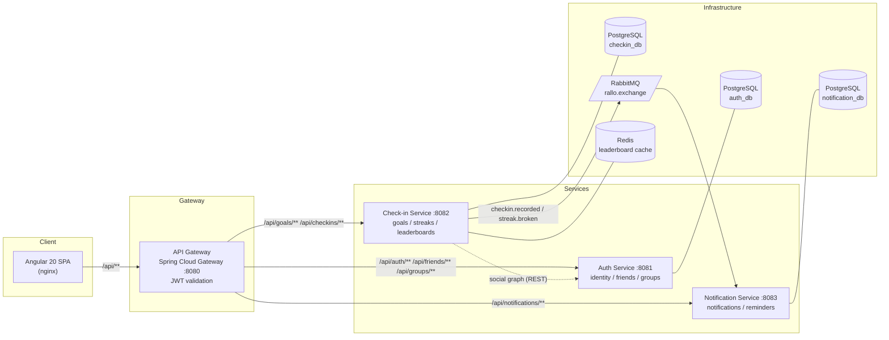

# 🔥 Rallo — build streaks, stay accountable

[](https://github.com/Jainoir/Rallo/actions/workflows/ci.yml)
[](https://github.com/Jainoir/Rallo/actions/workflows/codeql.yml)

A habit-tracking app — set daily/weekly goals, check in, build streaks, get reminded before a streak breaks, and compete with friends on group leaderboards. Built end-to-end as a **production-style Java/Spring microservices system with an Angular frontend**, deployed to the cloud through a security-gated CI pipeline.

**🌐 Try it live: [rallo-jainoir-web.onrender.com](https://rallo-jainoir-web.onrender.com)** — register, add a goal, check in.
*(Free-tier hosting: the first request after idle takes ~1 minute while services wake.)*


## The 60-second tour

| | |
|---|---|
| **Architecture** | 4 Spring Boot services behind a Spring Cloud Gateway; database-per-service PostgreSQL; async events over RabbitMQ; Angular 20 SPA |
| **Security** | JWT validated at the edge, BCrypt, gateway-secret service hardening, CodeQL + Trivy + gitleaks + OWASP scans in CI, protected `main` requiring green checks |
| **Testing** | 95 automated tests: unit (JUnit 5/Mockito, Jasmine), integration against real Postgres/RabbitMQ via Testcontainers, and a Playwright E2E that drives the browser through the whole stack in CI |
| **Operations** | Flyway-versioned schemas, one-command local stack (`docker compose up`), infrastructure declared in [render.yaml](render.yaml), auto-deploy on merge to `main`, $0/month hosting |
| **Documentation** | Live Swagger UI per service, [ARCHITECTURE.md](ARCHITECTURE.md), [4 ADRs](docs/adr/) recording design trade-offs, a [user guide](docs/USER_GUIDE.md) |

## Architecture



**Four decisions worth asking me about** (each has an [ADR](docs/adr/) with the trade-offs):

1. **[Database per service](docs/adr/0001-database-per-service.md)** — no shared tables, no cross-service joins; services coordinate through APIs and events.
2. **[JWT validated once at the edge](docs/adr/0002-jwt-at-the-edge.md)** — the gateway verifies tokens and forwards identity as headers; a gateway-stamped shared secret keeps services unreachable directly, even on a host without private networking.
3. **[Event-built read model for reminders](docs/adr/0003-notification-read-model.md)** — the nightly job never calls the check-in service; it queries a local projection built from consumed events.
4. **[Cross-service leaderboards with best-effort caching](docs/adr/0004-leaderboard-composition.md)** — the check-in service composes the auth service's social graph with its own streak data; Redis caches results and any Redis outage degrades to direct computation, never errors.

## Tech stack

| Layer | Technology |
|---|---|
| Backend | Java 21, Spring Boot 3.5, Spring Cloud Gateway, Spring Security, Spring Data JPA |
| Frontend | Angular 20 (standalone components, signals), TypeScript, RxJS |
| Data & messaging | PostgreSQL 16 (×3, Flyway migrations), RabbitMQ, Redis |
| Testing | JUnit 5, Mockito, AssertJ, Testcontainers, Jasmine/Karma, Playwright |
| CI / DevSecOps | GitHub Actions: build+test, CodeQL, OWASP Dependency-Check, gitleaks, Trivy, E2E |
| Delivery | Docker multi-stage builds, Docker Compose, Render blueprint auto-deploy |

## Run it locally

```bash
docker compose up --build
```

Then open http://localhost:4200. That's the entire setup — five containers, three databases, RabbitMQ, and Redis come up together.

| URL | What |
|---|---|
| http://localhost:4200 | Frontend |
| http://localhost:8080 | API gateway |
| http://localhost:8081/swagger-ui.html · [8082](http://localhost:8082/swagger-ui.html) · [8083](http://localhost:8083/swagger-ui.html) | Swagger UI per service |
| http://localhost:15672 | RabbitMQ management (rallo / rallo_pass) |

<details>
<summary><strong>Local development without Docker</strong> (JDK 21 + Node 22)</summary>

```bash
./mvnw verify                             # build + run all backend tests
./mvnw spring-boot:run -pl auth-service   # run a single service

cd frontend
npm install
npm start                                 # dev server on http://localhost:4200
```
</details>

<details>
<summary><strong>Try the API with curl</strong></summary>

```bash
# Register and grab a token
curl -s -X POST localhost:8080/api/auth/register \
  -H "Content-Type: application/json" \
  -d '{"username":"jane","email":"jane@example.com","password":"password123"}'

# Create a goal (replace $TOKEN)
curl -s -X POST localhost:8080/api/goals \
  -H "Authorization: Bearer $TOKEN" -H "Content-Type: application/json" \
  -d '{"title":"Gym","frequency":"DAILY"}'

# Check in (replace $GOAL_ID)
curl -s -X POST localhost:8080/api/checkins/goals/$GOAL_ID \
  -H "Authorization: Bearer $TOKEN" -H "Content-Type: application/json" \
  -d '{"checkinDate":"2026-07-01"}'
```
</details>

## Testing

```bash
./mvnw verify                   # backend: unit + Testcontainers integration tests
cd frontend && npm run test:ci  # frontend: Jasmine/Karma in headless Chrome
cd frontend && npm run e2e      # E2E: Playwright vs the compose stack
```

- **Unit tests** pin the business rules: streak calculation (daily, weekly targets, timezones), auth flows, JWT verification including forged and expired tokens, gateway filters, friendship/group rules, the leaderboard's Redis-outage fallback, and the reminder sweep.
- **Integration tests** boot every service against real PostgreSQL/RabbitMQ via Testcontainers — executing the Flyway migrations and Hibernate schema validation on each run.
- **E2E** drives a real browser through register → goal → check-in → streak across all services, on every push.

## CI / DevSecOps pipeline

Every push runs through [GitHub Actions](.github/workflows/ci.yml); `main` is a protected branch that requires the checks to pass, and every merge auto-deploys to Render:

1. **Build & Test** — Maven build with unit + integration tests
2. **Frontend Build & Test** — production build + headless browser tests
3. **SAST** — CodeQL analysis (Java + TypeScript)
4. **Secret scan** — gitleaks over the full git history
5. **Dependency scan** — OWASP Dependency-Check
6. **Container scan** — Trivy on all four service images, findings in the Security tab
7. **E2E** — Playwright against the full docker-compose stack

## Project layout & docs

```
api-gateway/            Spring Cloud Gateway — routing, CORS, JWT validation
auth-service/           Identity, JWT issuing, friendships, groups
checkin-service/        Goals, check-ins, streaks, leaderboards, event publishing
notification-service/   Event consumers, notifications, nightly reminder job
frontend/               Angular 20 SPA + Playwright E2E
docs/                   ADRs · user guide · screenshots
```

📖 [ARCHITECTURE.md](ARCHITECTURE.md) · [ADRs](docs/adr/) · [User guide](docs/USER_GUIDE.md) · [Deployment guide](DEPLOY.md)

## What's next

- Push/email delivery for notifications (in-app only today)
- Grace days for streaks; per-user reminder scheduling
- Gateway rate limiting (Redis)
