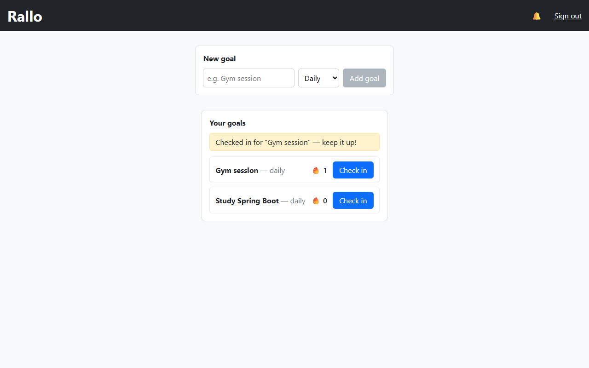

# Rallo — User Guide

Rallo helps you build habits by tracking streaks and keeping you accountable with friends.

**Live app:** https://rallo-jainoir-web.onrender.com *(free hosting — the first visit after a quiet period takes up to a minute while services wake up)*

## 1. Create an account

Open the app → **Create account** → pick a username, email, and password (8+ characters). You land on your dashboard, already signed in. Your username is how friends find you, so pick something you can share.

## 2. Set a goal

In **New goal**, name the habit (e.g. "Gym session") and choose:

- **Daily** — you intend to do it every day
- **Weekly** — you intend to hit a target number of days per week (pick 1–7)

Click **Add goal**.

## 3. Check in — and understand your streak 🔥

Each day you do the habit, press **Check in** on that goal. The flame shows your current streak. The rules:

- **Daily goals:** the streak counts consecutive days. Missing a full day breaks it. Checking in twice on the same day is politely refused — once is enough.
- **Weekly goals:** the streak counts consecutive weeks (Monday–Sunday) where you hit your target. The current week can't break your streak while it's still in progress — it only adds once you reach the target.
- Days roll over at **your** midnight — the app uses your device's timezone.

## 4. Notifications

The bell 🔔 shows your unread count:

- 🎉 **Milestones** — every 7th consecutive day
- ⏰ **Reminders** — sent nightly when yesterday's streak is one missed day from breaking
- 💔 **Broken streaks** — when a streak lapses, so you know to restart

Click **Mark read** to clear them.

## 5. Friends

In the **Friends** panel, enter a friend's username and **Send request**. They'll see it in their Friends panel and can **Accept**. Once connected, the **streak leaderboard** shows everyone's best current streak — you included. Top spot gets the highlight.

## 6. Groups

Create a group ("Gym crew"), then add members by username — only the group's creator can add people. Everyone in the group sees the same **group leaderboard**: each member's best current streak, ranked. Fall behind and everyone knows; that's the accountability part.

## Tips

- The demo runs on free-tier hosting: if a page or action seems slow on first use, it's the backend waking up — give it up to a minute and retry.
- Your account has no email verification or password reset yet — remember your password.
